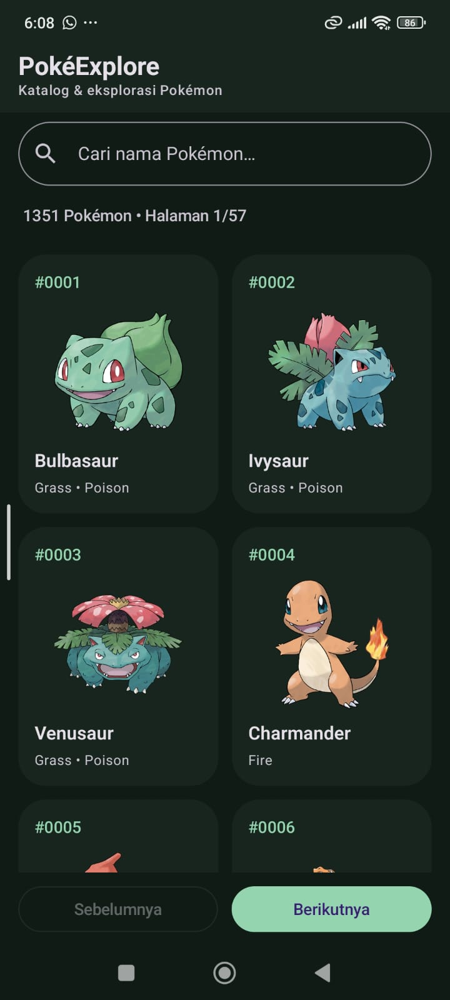
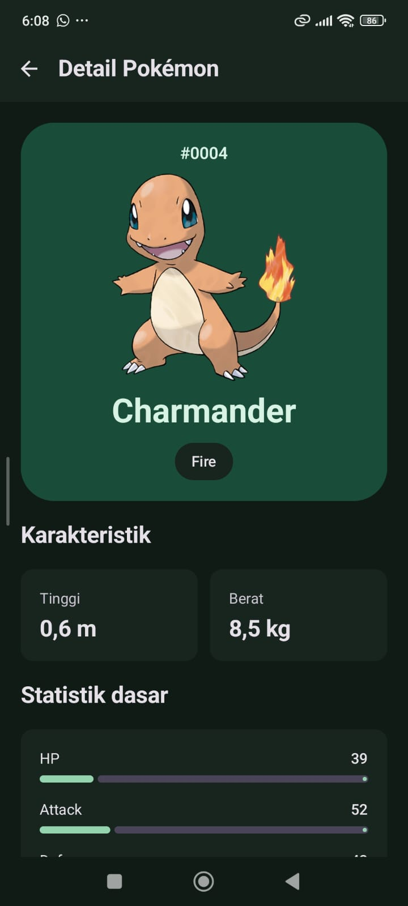
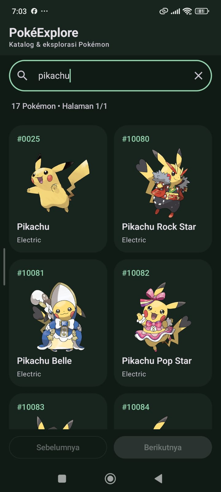
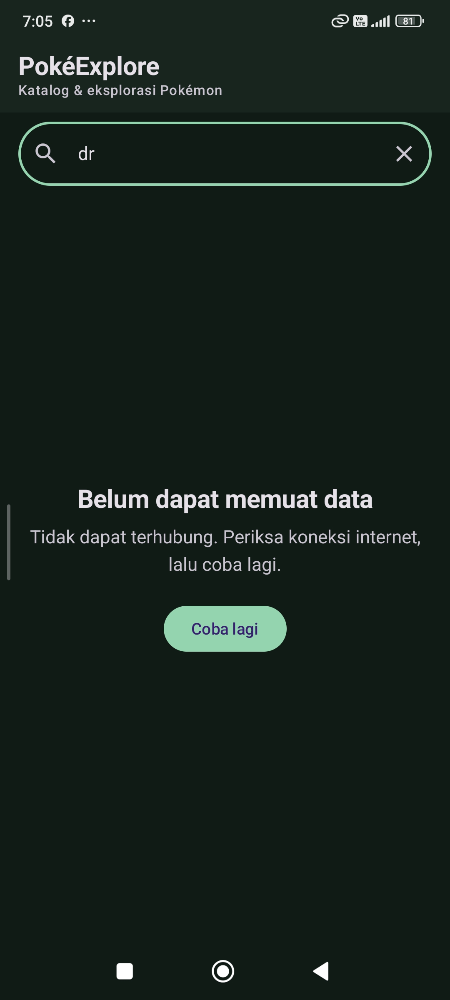

# PokéExplore
> Aplikasi katalog dan eksplorasi Pokémon berbasis Jetpack Compose.

---

## 👤 Identitas Praktikan

- **Nama Lengkap:** Yusuf Rafii Ahmad
- **NIM:** H1D024049
- **Shift Awal:** I
- **Shift Akhir:** C
- **Link Video Penjelasan Teknis:** [Tonton video](LINK_VIDEO)

---

## 📱 Deskripsi Aplikasi

PokéExplore merupakan aplikasi Android untuk mencari dan melihat informasi Pokémon. Data diperoleh secara dinamis dari PokéAPI melalui jaringan internet.

Aplikasi menyediakan halaman katalog dan halaman detail. Pengguna dapat mencari Pokémon berdasarkan nama, melihat gambar dan tipe, serta mempelajari tinggi, berat, dan statistik dasarnya.

Proyek ini menerapkan materi praktikum pemrograman mobile, meliputi Kotlin, Jetpack Compose, Material Design 3, lazy layout, state dan recomposition, navigasi, networking, serta arsitektur MVVM.

---

## 🛠️ Penjelasan Teknis

### 1. Spesifikasi dan Tech Stack

- **Bahasa:** Kotlin 2.1.10
- **UI Framework:** Jetpack Compose
- **Design System:** Material Design 3
- **Minimum SDK:** 24 — Android 7.0
- **Compile SDK:** 35
- **Target SDK:** 35 — Android 15
- **Arsitektur:** MVVM dengan Repository
- **Sumber Data:** PokéAPI

Library utama:

| Library | Kegunaan |
|---|---|
| Navigation Compose | Navigasi antara Home dan Detail |
| ViewModel | Mengelola state dan logika layar |
| StateFlow | Menyediakan perubahan state untuk diamati UI |
| SavedStateHandle | Membantu menyimpan dan memulihkan query serta nomor halaman |
| Retrofit | Mengakses REST API |
| Gson Converter | Memetakan respons JSON menjadi objek Kotlin |
| OkHttp | Menangani komunikasi HTTP, timeout, dan HTTP cache |
| Coil | Memuat gambar dari URL |
| Kotlin Coroutines | Menangani pekerjaan asinkron |

### 2. Fitur Utama

#### A. Katalog Pokémon

Home menampilkan kumpulan Pokémon menggunakan `LazyVerticalGrid`. Setiap kartu berisi ID, nama, gambar, dan tipe Pokémon.

Detail dimuat sebanyak maksimal 24 Pokémon per halaman. Pengguna dapat berpindah menggunakan tombol Sebelumnya dan Berikutnya.

#### B. Pencarian Pokémon

Pencarian mendukung sebagian nama dan tidak membedakan huruf besar maupun kecil.

Aplikasi mengambil indeks nama dari API, kemudian memfilter indeks tersebut di ViewModel. Pencarian tidak terbatas pada Pokémon yang sedang terlihat di halaman pertama.

Debounce 350 milidetik dan pembatalan pekerjaan sebelumnya digunakan untuk mengutamakan input terbaru.

#### C. Detail Pokémon

Halaman detail menampilkan:

- ID Pokémon.
- Nama Pokémon.
- Gambar Pokémon.
- Tipe Pokémon.
- Tinggi dalam meter.
- Berat dalam kilogram.
- Statistik dasar dan total statistik.

Tinggi dari API dikonversi dari desimeter menjadi meter, sedangkan berat dikonversi dari hektogram menjadi kilogram.

#### D. Loading, Error, dan Hasil Kosong

Tampilan mengikuti kondisi `UiState`:

- `Loading`: menampilkan indikator pemuatan.
- `Success`: menampilkan data yang berhasil diperoleh.
- `Error`: menampilkan pesan kesalahan dan tombol Coba lagi.

Jika pencarian berhasil tetapi tidak menemukan nama yang cocok, aplikasi menampilkan pesan hasil kosong.

#### E. Gambar dan Tema

Gambar dimuat menggunakan Coil. Aplikasi menyediakan gambar pengganti apabila URL kosong atau pemuatan gagal, serta tombol untuk mencoba kembali ketika gambar gagal dimuat.

Tema terang dan gelap mengikuti pengaturan perangkat.

### 3. Arsitektur MVVM

| Bagian | Implementasi | Tanggung jawab |
|---|---|---|
| View | `HomeScreen`, `DetailScreen` | Menampilkan state dan menerima interaksi pengguna |
| ViewModel | `PokemonViewModel` | Mengelola pencarian, pagination, serta state katalog dan detail |
| Lapisan data | Model, Repository, API Service | Menyediakan struktur data dan akses ke API |
| Repository | `RemotePokemonRepository` | Mengambil indeks/detail serta mengelola cache |
| API Service | `PokemonApiService` | Mendefinisikan endpoint Retrofit |

Ketika pengguna melakukan pencarian, View memanggil fungsi pada ViewModel. ViewModel meminta data melalui Repository. Jika data belum tersedia dalam cache, Repository mengambilnya melalui API Service.

Hasilnya mengubah StateFlow pada ViewModel. Compose mengamati perubahan tersebut dan memperbarui tampilan melalui recomposition.

Pengambilan data API tidak dilakukan langsung di dalam Composable.

### 4. Struktur Direktori Proyek

Lokasi package utama:

`app/src/main/java/com/pemmob/yusuf/pokeexplore/`

| File atau Folder | Fungsi |
|---|---|
| `MainActivity.kt` | Titik masuk aplikasi, pembuatan dependency, dan navigasi |
| `data/model/` | Data class untuk memetakan JSON |
| `data/remote/` | API Service dan konfigurasi Retrofit |
| `data/repository/` | Pengambilan data dan cache |
| `ui/components/` | Komponen reusable seperti kartu, gambar, loading, dan pesan |
| `ui/screens/` | Home Screen dan Detail Screen |
| `ui/state/` | Definisi Loading, Success, dan Error |
| `ui/viewmodel/` | Pengelolaan state serta logika layar |
| `ui/theme/` | Warna, typography, dan tema |
| `util/` | Fungsi pemformatan nama, ID, satuan, dan label statistik |

### 5. API yang Digunakan

Aplikasi menggunakan **PokéAPI**, yang dapat diakses tanpa API key.

- **Dokumentasi:** https://pokeapi.co/docs/v2
- **Base URL:** https://pokeapi.co/api/v2/

| Endpoint | Kegunaan |
|---|---|
| `GET pokemon?limit=1` | Mengetahui jumlah data melalui field count |
| `GET pokemon?limit={count}` | Mengambil indeks nama dan URL Pokémon |
| `GET pokemon/{id atau name}` | Mengambil detail Pokémon |

Contoh detail Pikachu:

https://pokeapi.co/api/v2/pokemon/25

Endpoint daftar menyediakan nama dan URL. Informasi gambar, tipe, tinggi, berat, dan statistik diperoleh dari endpoint detail.

URL gambar diambil dari `sprites.other.official-artwork.front_default`. Jika tidak tersedia, aplikasi menggunakan `sprites.front_default`.

### 6. State dan Recomposition

State utama dikelola dalam `PokemonViewModel` menggunakan `MutableStateFlow` dan dipublikasikan sebagai StateFlow yang dapat dibaca UI.

UI mengamati state menggunakan `collectAsStateWithLifecycle()`. Ketika state berubah, Compose memperbarui bagian tampilan yang bergantung pada state tersebut.

Penerapan lainnya:

- **State hoisting:** Home menerima state dan callback dari luar.
- **Lambda:** digunakan untuk tindakan pencarian, klik kartu, pergantian halaman, dan navigasi kembali.
- **remember:** menyimpan state lokal pemuatan gambar.
- **LaunchedEffect:** memicu pemuatan detail sesuai ID dan mengatur posisi scroll.
- **SavedStateHandle:** membantu pemulihan query dan nomor halaman.

### 7. Cache dan Penanganan Jaringan

Repository menyimpan detail Pokémon dalam cache memori berdasarkan nama dan ID.

Permintaan detail dibatasi maksimal empat pekerjaan bersamaan menggunakan `Semaphore(4)`. Retrofit menggunakan timeout agar permintaan tidak menunggu tanpa batas.

HTTP disk cache mengikuti kebijakan server. Cache membantu penggunaan ulang data, tetapi aplikasi tidak menjamin seluruh fitur dapat digunakan tanpa internet.

---

## 📸 Tangkapan Layar

|                Home                 |                 Detail                  |
|:-----------------------------------:|:---------------------------------------:|
|  |  |

|                   Pencarian                   |                 Error                 |
|:---------------------------------------------:|:-------------------------------------:|
|  |  |

---

## 🚀 Cara Menjalankan Proyek

### Prasyarat

- Android Studio yang kompatibel dengan konfigurasi proyek.
- JDK 17 sebagai konfigurasi build yang telah diuji.
- Android SDK 35.
- Emulator atau HP dengan Android 7.0 atau lebih tinggi.
- Koneksi internet untuk mengunduh dependency dan mengambil data API.

### Langkah

1. Clone repository:

   ```bash
   git clone [URL_REPOSITORY]
   ```

2. Buka folder proyek yang berisi `settings.gradle.kts` melalui Android Studio.
3. Tunggu proses Gradle Sync selesai.
4. Pastikan lokasi Android SDK dikenali.
5. Pilih emulator atau HP yang sudah mengaktifkan USB debugging.
6. Klik Run untuk menjalankan aplikasi.

Aplikasi tidak memerlukan backend lokal, database, atau API key.

### Build dan Unit Test

Jalankan melalui Terminal Android Studio pada Windows:

```powershell
.\gradlew.bat :app:assembleDebug :app:testDebugUnitTest :app:lintDebug
```

APK debug hasil build tersedia di:

`app/build/outputs/apk/debug/app-debug.apk`

---

## 🎥 Video Penjelasan Teknis

Video menjelaskan implementasi kode, meliputi:

1. Struktur proyek dan arsitektur MVVM.
2. Data model dan pemetaan JSON.
3. API Service, Retrofit, dan Repository.
4. Pengelolaan state pada ViewModel.
5. Pencarian, debounce, dan pagination.
6. LazyVerticalGrid dan reusable composable.
7. Navigasi menuju detail.
8. Loading, error handling, dan recomposition.
9. Demonstrasi singkat aplikasi sebagai bukti implementasi.

**Link video:** [Tonton penjelasan teknis](LINK_VIDEO)

---

## 📚 Referensi

- Modul Praktikum Pemrograman Mobile Pertemuan 1–5.
- Soal Responsi Praktikum Pemrograman Mobile Shift C.
- [PokéAPI Documentation](https://pokeapi.co/docs/v2)
- [Jetpack Compose](https://developer.android.com/compose)
- [Retrofit](https://square.github.io/retrofit/)
- [Coil](https://coil-kt.github.io/coil/)